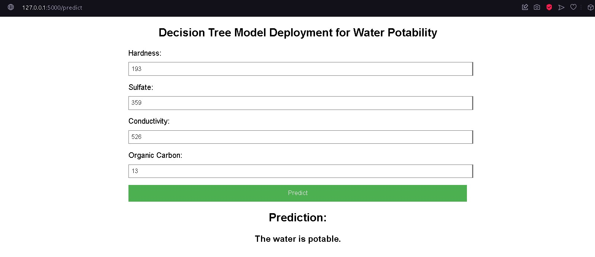
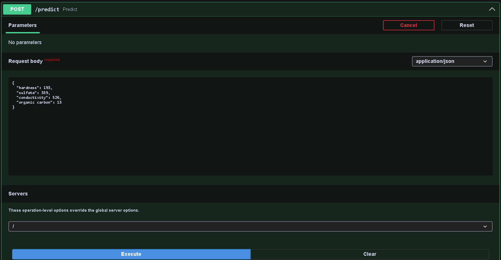
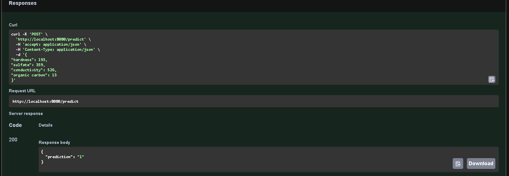
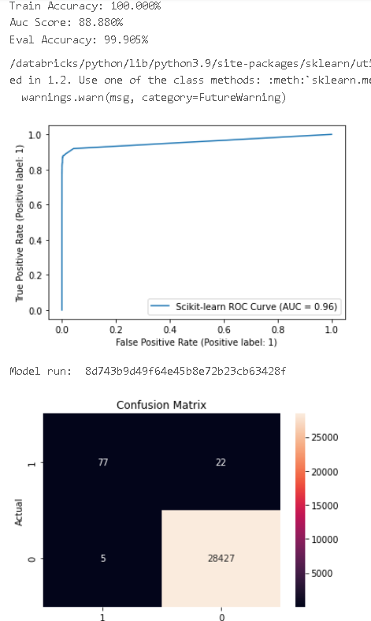
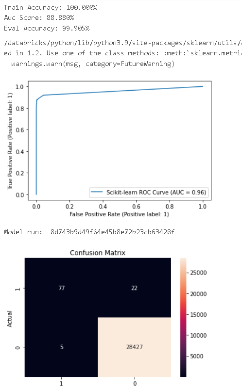
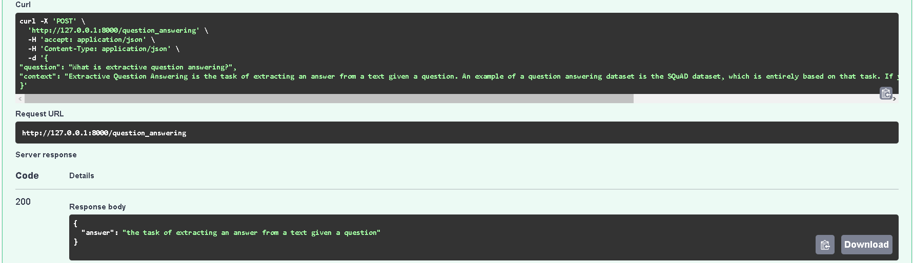
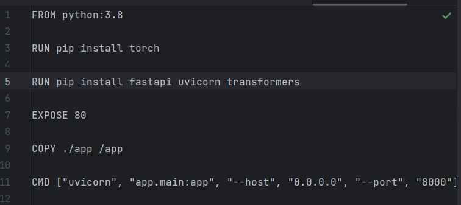
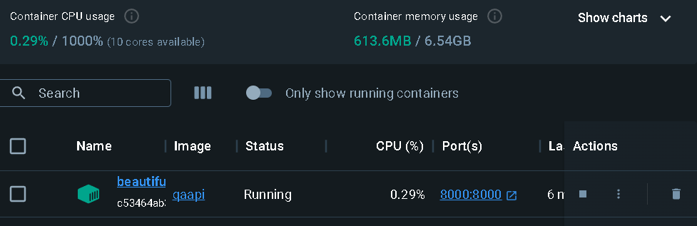
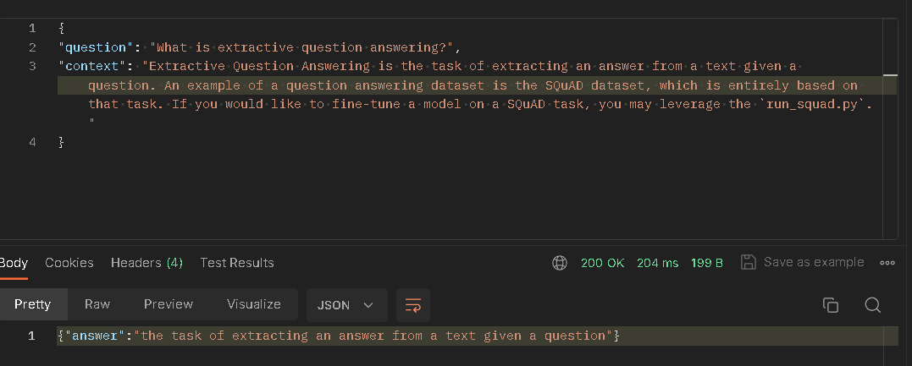
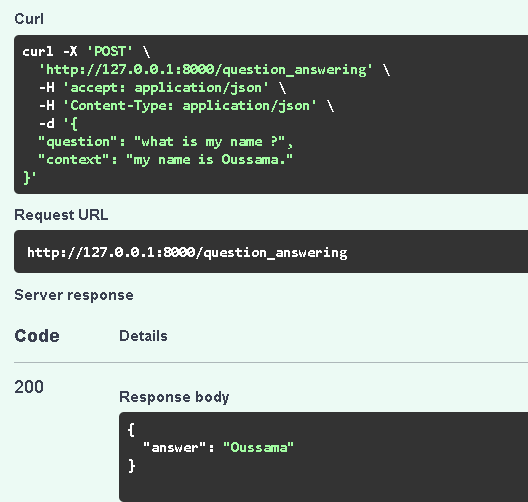

# Atelier 1 : FLask

### Decision Tree Model Deployment for Water Potability

This project is a web application designed to predict the potability of water based on specific water quality parameters. It utilizes a decision tree machine learning model to make predictions. Users can input values for water hardness, sulfate concentration, conductivity, and organic carbon content via a user-friendly HTML form. Upon submission, the model processes the inputs and provides a binary prediction, indicating whether the water is potable (safe to drink) or non-potable.

# Atelier 2 : FastAPI Pydantic

Same work as FLASK just using FastAPI Pydantic.

# Atelier 3 : Model Packaging

Tried everything to make azure work, but no luck.

# Atelier 4 : Mlflow - Databricks

# Atelier : Model Testing

## 1 - FastAPI Transformer model serving

## 2 - Dockerizing API

### Docker :

### Postman :

## 3 - Faster Transformer model serving using Tensorflow Extended

